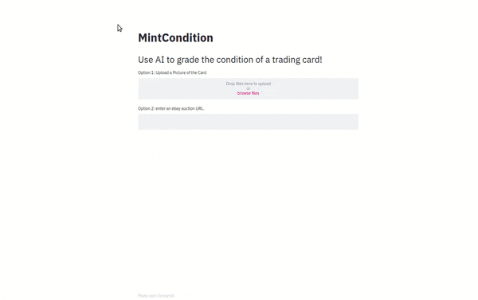
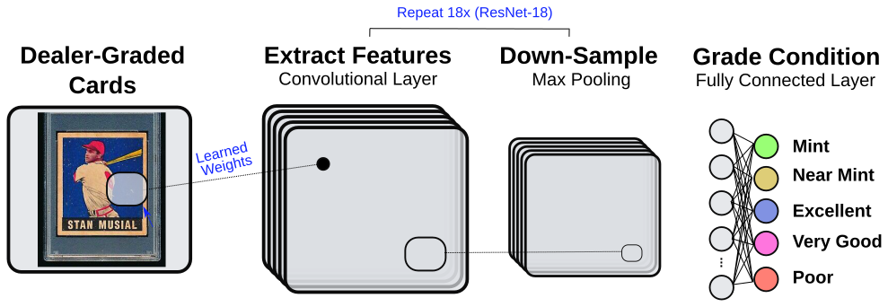

# Overview
There is $5 billion market for sports memorabilia every year, a large part of which are trading cards. The value of a card depends highly on its condition, yet existing ways to grade the condition of a card are not effective for most transactions. Amateurs are highly inaccurate at grading cards themselves, and expert annotations are too costly and time-intensive for the vast majority of transactions. The result is that millions of trading cards are simply sold as ungraded. To address this problem, MintCondition is a web application that automatically grades trading cards from a picture, aiming to put near-expert level accuracy within reach of everyday amateur transactions.

# Quick Start
* **Use Mint Condition:** [bit.ly/mintc-app](bit.ly/mintc-app)
* **See How the Model Was Trained** [scripts/train_ml_model.py](scripts/train_ml_model.py)
* **See How the Front-End Works** [front_end/MintCondition.py](front_end/MintCondition.py)

# How Mint Condition Works
Mint Condition uses a machine learning model, specifically a Convolutional Neural Network (ResNet-18 trained from scratch), to predict the labels that experts assigned to training cards. In pilot experiments, this approach works much better than simply fine-tuning the top layer of a pretranied network, perhaps because low-level visual features such as scratches, printing defects, and rounded corners are very important for grading trading cards.

# Training Data
Mint Condition was trained to predict the labels of professionally-graded cards from Ebay auctions. Currently, it was trained on just over 90,000 such cards. While the dataset is too large to make available on GitHub, you can acquire the data yourself using [scripts/download_ebay.py](scripts/download_ebay.py). You will need to acquire Ebay API keys for this process.

